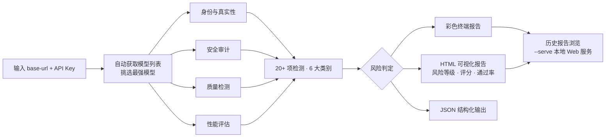
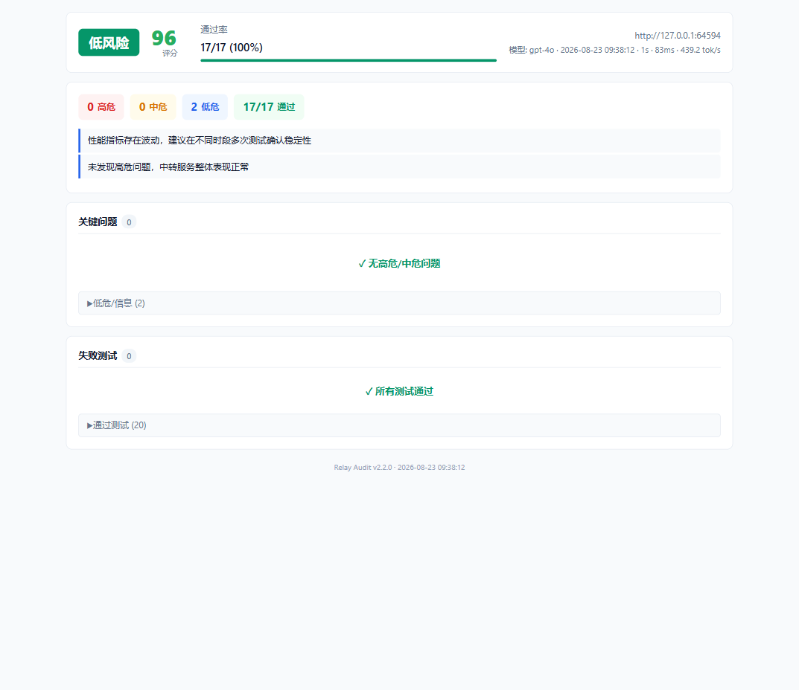

# Relay Audit

<p align="center">
  
  
  
  
  
</p>

**OpenAI 兼容中转 API 安全与质量检测工具** — 提供 API Key 和地址即可完成中转服务的安全审计、身份验证、质量检测与性能评估，并生成可视化报告。

买第三方中转 API 之前先跑一遍，自建中转站也可以拿来日常巡检。

## 检测流程



## 示例报告

对本地 mock 服务（模拟真实中转站）跑完整扫描生成的报告界面——风险等级、评分、通过率、关键问题与失败测试一目了然：

| HTML 可视化报告（低风险样例） |
| :---: |
|  |

## 功能特性

- **一条命令检测** — 仅需 `--base-url` 和 API Key；未指定模型时自动获取模型列表并挑选最强模型，交互模式（零参数启动）可自动并发检测 3 个最强模型
- **身份与真实性** — 模型偷换检测、身份识别探针、知识截止日期验证、模型综合指纹、模型列表一致性、可疑/非标准模型名识别（规则数据与代码分离，`--refresh-sus` 在线更新判定阈值，无需升级工具）
- **安全审计** — System Prompt 完整性（随请求注入 canary 标记，检测系统消息被篡改或内容泄露）、危险内容拒答检测（破坏性删除、Cookie 窃取、勒索软件、反向 Shell、SQL 注入），结合危险内容模式与拒答模式双重判定
- **质量检测** — 基础对话、指令遵循、多轮对话、长上下文、编码一致性、乱码检测、Token 计费校验；JSON 模式与 Function Calling 失败时自动降级为纯文本重试
- **性能评估** — 延迟统计（p50 / 抖动；样本充足时含 p95 / p99）、稳定性采样、并发突发测试、流式响应（SSE）测试与首字延迟（TTFT）测量
- **模型对比** — `--compare` 并排对比多个模型的真实身份与响应
- **报告输出** — 彩色终端报告（rich）、HTML 报告（风险等级、评分、通过率、改进建议）、JSON 输出，扫描结果自动持久化到报告目录（Windows `%LOCALAPPDATA%\relay-audit\reports`，Linux/macOS `~/.relay_audit/reports`，可用环境变量 `RELAY_AUDIT_REPORTS_DIR` 覆盖；默认自动清理 7 天前的旧报告，`RELAY_AUDIT_REPORT_TTL_DAYS=0` 可关闭）。报告携带探针套件版本号，不同时间的扫描结果可复现、可对比
- **历史报告浏览** — 内置本地 Web 服务器，在浏览器中浏览往期 HTML / JSON 扫描报告
- **隐私与安全** — 报告与日志中 API Key 自动脱敏；`--save-key` 以受限权限（Linux/macOS `0o600`，Windows 经 `icacls`）保存在本地

## 技术栈

- **Python 3.10+**
- **httpx** — 异步 HTTP 客户端（连接池、指数退避重试、SSE 流式解析）
- **rich** — 终端富文本渲染
- **Python 标准库** `http.server` — 报告浏览服务器
- **开发 / CI** — pytest、pytest-asyncio、ruff、mypy，GitHub Actions 自动执行 lint 与测试

## 安装与运行

推荐从源码安装：

```bash
git clone https://github.com/xiaomaozjj666/relay-audit.git
cd relay-audit
python -m pip install -e .
```

若已发布到 PyPI，也可直接 `pip install relay-audit`。

### 最简用法

设置环境变量后直接运行（自动选择最强模型）：

```bash
# Windows
set RELAY_API_KEY=<your-key>
relay-audit --base-url https://api.example.com

# Linux / macOS
export RELAY_API_KEY=<your-key>
relay-audit --base-url https://api.example.com
```

### 交互模式（零参数启动）

```bash
relay-audit
```

按提示输入 Key（**掩码显示，不回显明文**）和地址，工具会自动获取模型列表并选择最强的 3 个模型并发检测。检测前可确认或挑选模型：直接回车全部检测，或输入序号（如 `1,2`）、模型名（如 `claude` 模糊匹配）筛选。

Windows 下也可直接运行仓库中的 `relay_audit.bat`。

### 退出码

| 退出码 | 含义 |
|--------|------|
| `0` | 扫描完成，未发现高危问题 |
| `1` | 扫描完成，发现高危问题 |
| `2` | 参数或 API Key 错误 |
| `130` | 用户取消（Ctrl+C） |

> 扫描过程实时输出每项测试的进度（`[OK]` / `[x ]` + 延迟），长扫描无需干等。

## 使用示例

```bash
# 指定模型检测
relay-audit --base-url https://api.example.com --model claude-opus-4-6

# 只看模型列表
relay-audit --base-url https://api.example.com --models

# 快速模式（跳过部分高级测试）
relay-audit --quick --base-url https://api.example.com

# 流式响应测试
relay-audit --stream --base-url https://api.example.com

# 启用 JSON 输出
relay-audit --json --base-url https://api.example.com

# 保存 Key 到本地以便下次自动读取
relay-audit --key <your-key> --save-key

# 对比多个模型
relay-audit --base-url https://api.example.com --model gpt-4o --compare claude-opus-4-6

# 指定输出报告路径
relay-audit --base-url https://api.example.com --output report.html

# 启动报告浏览服务器（浏览历史扫描结果）
relay-audit --serve 8080

# 本地仿真中转站：安全体验完整检测流程（不花真钱、无封号风险）
python scripts/mock_relay.py --port 8931
relay-audit --base-url http://127.0.0.1:8931 --stream
```

## 命令行参数

| 参数 | 说明 | 默认值 |
|------|------|--------|
| `--base-url` | API 端点地址 | 必填 |
| `--model` | 指定检测模型 | 自动选择 |
| `--key` | API Key（优先于环境变量） | - |
| `--api-key-env` | Key 环境变量名 | `RELAY_API_KEY` |
| `--timeout` | 请求超时秒数 | 60 |
| `--samples` | 稳定性采样次数 | 2 |
| `--compare` | 对比模型（可多次使用） | - |
| `--quick` | 快速模式（跳过部分高级测试） | `false` |
| `--stream` | 启用流式响应测试 | `false` |
| `--json` | 输出 JSON 格式结果 | `false` |
| `--output` | 报告输出路径 | 自动生成 |
| `--no-html` | 不生成 HTML 报告 | `false` |
| `--skip-safety` | 跳过安全测试 | `false` |
| `--config` | JSON 配置文件路径 | - |
| `--save-key` | 保存 Key 到本地 | `false` |
| `--models` / `--list-models` | 只展示模型列表，不跑测试 | `false` |
| `--refresh-sus` | 在线刷新可疑模型名规则集并缓存本地 | `false` |
| `--serve [PORT]` | 启动报告浏览服务器 | 8080 |

> 注意：`--save-key` 将 API Key **明文**保存在 `~/.relay_key`。工具会收紧该文件权限
> （Linux/macOS 为 `0o600`，Windows 通过 `icacls` 仅授权当前用户），但不加密内容——
> 共享机器上请慎用，或改用环境变量。

> ⚠️ **封号风险**：安全审计会向目标 API 发送真实的恶意请求样本（勒索软件、
> 反向 Shell、SQL 注入等）以检测拒答能力，并发/突发测试也会产生短时高频请求。
> 部分中转站对此零容忍，可能直接封禁账号或 Key——真实校准中已观察到扫描后
> 账号被封（`USER_INACTIVE`）。请仅测试你拥有权限的端点，用小号/测试 Key，
> 并自行评估风险。

## 配置

### 环境变量

| 变量 | 说明 |
|------|------|
| `RELAY_API_KEY` | API Key（也可用 `--key` 或 `--save-key` 提供） |
| `RELAY_AUDIT_REPORTS_DIR` | 报告目录（默认 Windows `%LOCALAPPDATA%\relay-audit\reports`，Linux/macOS `~/.relay_audit/reports`） |
| `RELAY_AUDIT_REPORT_TTL_DAYS` | 旧报告自动清理天数（默认 7，设 `0` 表示永不清理） |
| `RELAY_AUDIT_SUS_URL` | 可疑模型名规则集的自定义下载地址（默认本项目 main 分支） |
| `RELAY_AUDIT_DATA_DIR` | 规则缓存目录（默认 Windows `%LOCALAPPDATA%\relay-audit`，Linux/macOS `~/.relay_audit`） |

如需使用其他环境变量名，通过 `--api-key-env <NAME>` 指定。

### 配置文件

支持 JSON 配置文件（通过 `--config` 指定）：

```json
{
  "base_url": "https://api.example.com",
  "model": "claude-opus-4-6",
  "timeout": 60,
  "samples": 3,
  "quick": false,
  "stream": false
}
```

## 检测项目

完整扫描（默认非快速模式）共 20+ 项检测，覆盖 6 大类别：

| 类别 | 检测内容 |
|------|----------|
| 安全 | System Prompt 完整性（canary 注入）、危险内容拒答（破坏性删除 / Cookie 窃取 / 勒索软件 / 反向 Shell / SQL 注入） |
| 身份 | 模型身份识别、模型偷换检测、知识截止日期验证、模型指纹、模型列表一致性 |
| 质量 | 基础对话、指令遵循、编码一致性、JSON 模式、Function Calling、多轮对话、长上下文、Token 计费校验、乱码检测 |
| 性能 | 延迟统计（p50 / 抖动；样本 ≥20 时含 p95 / p99）、并发突发测试、稳定性采样、流式首字延迟（TTFT） |
| 模型 | 可疑模型名检测、多供应商聚合识别、大小写重复检测 |
| 通用 | 代理 / CDN 特征检测、响应头分析、错误模式识别 |

> 探针提示与判定规则统称为「探针套件」，以 `relay_audit.scanner.PROBE_SUITE_VERSION` 标识版本并写入每份报告；修改探针时需递增该版本号。

## 检测有效性校准

检测结论的可信度需要用已知底细的目标来验证。内置校准工具：对一组已知真实情况（是否应触发高危）的中转站批量扫描，输出混淆矩阵与精确率/召回率，把严重等级从经验值校准为实证值。

1. 准备目标清单 `targets.json`：

```json
[
  {"name": "直连官方", "base_url": "https://api.example.com",
   "api_key": "sk-...", "label": "no_high", "note": "官方 API，不应有高危"},
  {"name": "偷换站A", "base_url": "https://relay.example.com",
   "api_key": "sk-...", "label": "high", "model": "gpt-4o",
   "note": "已知 gpt-4o 被换成小模型"}
]
```

2. 运行（报告默认写入 `<报告目录>/calibration/`）：

```bash
relay-audit-calibrate targets.json            # 或 python -m relay_audit.calibrate targets.json
```

3. 查看 `calibration_*.md`（混淆矩阵、精确率/召回率、每目标明细）与每目标原始 JSON。

退出码：`0` 判定全部与真实情况一致；`1` 存在误报/漏报；`2` 有目标扫描失败或清单无效。

## 项目结构

```
relay_audit/
├── __init__.py       # 包入口与版本信息
├── __main__.py       # python -m relay_audit 入口
├── cli.py            # 命令行入口 & 交互模式
├── models.py         # 数据类型定义
├── patterns.py       # 检测模式与常量定义
├── analysis.py       # 分析检测逻辑（错误诊断、稳定性、并发等）
├── client.py         # OpenAI API 异步客户端
├── scanner.py        # 测试编排与执行
├── calibrate.py      # 检测有效性校准（混淆矩阵 / 精确率 / 召回率）
├── reporter.py       # 报告生成（HTML / 终端 / JSON）
└── serve.py          # 报告浏览 Web 服务器
```

## 开发

```bash
# 安装开发依赖
python -m pip install -r requirements-dev.txt

# 本地安装
python -m pip install -e .

# 运行测试
pytest tests/ -v

# 代码检查
ruff check .
ruff format --check .
mypy relay_audit
```

## 许可证

[MIT License](LICENSE)

## 文档

- [English Documentation](README.en.md)
- [更新日志](CHANGELOG.md)
- [参与贡献](CONTRIBUTING.md)
